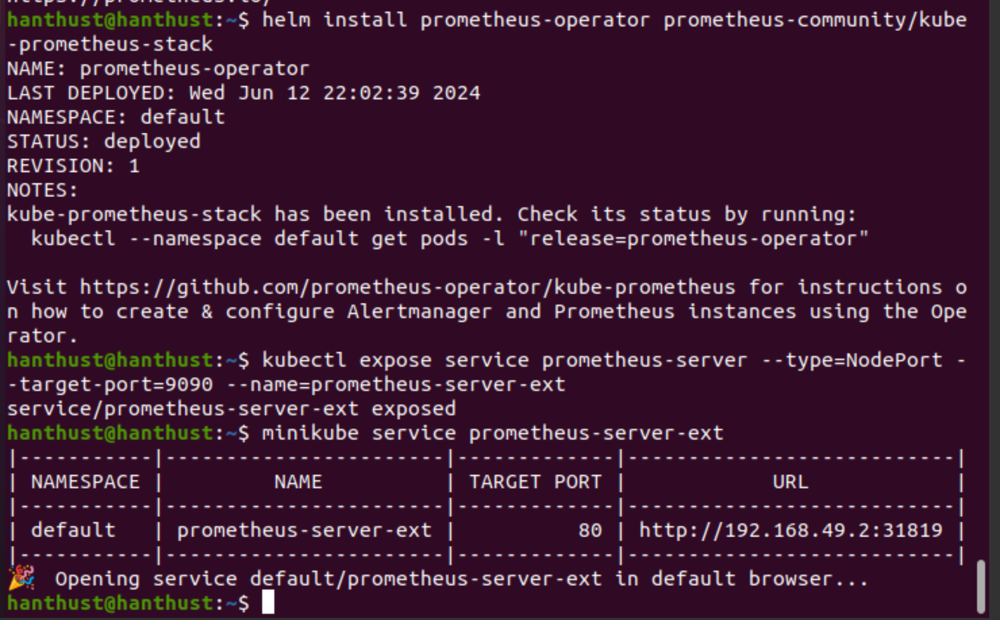

# Viettel Digital Talent 2024 - Project
Author: **Nguyen Thu Ha**

## Table of Contents 
- [0. Requirements](#0-requirements)
- [1. Building a simple 3-tier web application](#1-building-a-simple-3-tier-web-application)
- [2. Containerization](#2-containerization)
- [3. Continuous Integration](#3-continuous-integration)
- [4. Automation](#4-automation)
- [5. Research report](#5-research-report)
- [6. Kubernetes deployment](#6-kubernetes-deployment)
- [7. K8S helm chart](#7-k8s-helm-chart)
- [8. Continuous delivery](#8-continuous-delivery)
- [9. Monitoring](#9-monitoring)
- [10. Logging](#10-logging)
- [11. Security](#11-security)

## 0. Build a 3-tier web application
### Requirements
- Phát triển web application có các chức năng sau (0.5đ):
    - Hiển thị danh sách sinh viên tham gia chương trình VDT2024 dưới dạng bảng với các thông tin sau: Họ và tên, Giới tính, trường đang theo học. 
    - Cho phép xem chi tiết/thêm/xóa/cập nhật thông tin sinh viên.
- Thiết kế hệ thống với ba dịch vụ (1đ): 
    - web: Giao diện web, tuỳ chọn ngôn ngữ, framework.
    - api: RESTful API viết bằng ngôn ngữ lập trình tùy chọn, có đầy đủ các chức năng: list, get, create, update, delete.
    - db: Database SQL hoặc NoSQL lưu trữ thông tin sinh viên.
- Viết unit tests cho các chức năng APIs, mỗi API tối thiếu 1 testcase (0.5đ).
- Maintain source code của api và web ở 2 repo khác nhau, mỗi feature là 1 Pull Request (1đ). 


### Output

- View student list:
    
- Create student
    
- Edit student
    
- Delete student
    

- Unit test API (source code can be found in [here](https://github.com/nguyenha-meiii/vdt_midterm_api/blob/main/unit_test.py)):
  - Sử dụng thư viện unittest của python (mock testing)
  - Để chạy unittest, sử dụng lệnh: 
    ```shell
    python -m unittest unit_test.py
    ```
    Result: 
   

- Maintain source code:
    - Repo của Web: [vdt_midterm_web](https://github.com/nguyenha-meiii/vdt_midterm_web)
    - Repo của API: [vdt_midterm_api](https://github.com/nguyenha-meiii/vdt_midterm_api)

## 1. Containerization

### Requirements
- Viết Dockerfile để ở từng repo để đóng gói các dịch vụ trên thành các container image (1đ)
- Yêu cầu image đảm bảo tối ưu thời gian build và kích thước chiếm dụng, khuyến khích sử dụng các thủ thuật build image đã được giới thiệu (layer-caching, optimized RUN instructions, multi-stage build, etc.) (1đ)


### Output

- Xây dựng docker-compose file để chạy nhiều container trong cùng một thời điểm với câu lệnh dưới đây:
    - Build command:
        ```shell
        docker-compose up -d
        ```

    - Kết quả:
     

### Web
- Dockerfile:
  - [web](https://github.com/nguyenha-meiii/vdt2024/blob/main/web/Dockerfile)
  - Build command:
    ```shell
    docker build -t web . | tee web_build.log
    ```
  - Kết quả:
  

  - Docker history command:
     ```shell
    docker history web | tee web_history.log
    ```
  - Kết quả: [web_history](https://github.com/nguyenha-meiii/vdt2024/blob/main/web/web_history.log)


### API
-Dockerfile:
  - [api](https://github.com/nguyenha-meiii/vdt2024/blob/main/API/Dockerfile)
  - Build command:
    ```shell
    docker build -t api . | tee api_build.log
    ```
  - Kết quả: 
  

  - Docker history command:
     ```shell
    docker history api | tee api_history.log
    ```
  - Kết quả: [api_history](https://github.com/nguyenha-meiii/vdt2024/blob/main/API/api_history.log)

### Optimization
- Sử dụng multi-stage build và layer-caching để tối ưu hoá thời gian build và kích thước chiếm dụng. Kết quả cho thấy thời gian chạy đã giảm đáng kể:
    - Docker layer caching:
    
    Ví dụ: Dockerfile của front-end + Nginx server:
    ```yml
    FROM node:alpine AS build
    WORKDIR /app
    COPY package*.json ./
    RUN npm install
    COPY . .
    RUN npm run build

    FROM nginx:1.22.0-alpine
    COPY ./nginx.conf /etc/nginx/conf.d/default.conf
    COPY --from=build /app/build /usr/share/nginx/html
    EXPOSE 80
    CMD ["nginx", "-g", "daemon off;"]
    ```

    Kết quả: 
    
    

    - Multi-stage build: Bằng cách sử dụng xây dựng đa giai đoạn (multi-stage build), chúng ta chỉ cần một Dockerfile để tối ưu hóa kích thước ảnh. Ảnh cuối cùng chỉ chứa những gì cần thiết để chạy ứng dụng, giảm thiểu kích thước so với việc sử dụng hai Dockerfile riêng biệt.

     ```yml
      COPY --from=build /app/build /usr/share/nginx/html
    ```

## 2. Continuous Integration
### Requirements
- Tự động chạy unit test khi tạo PR vào branch main (0.5đ)
- Tự động chạy unit test khi push commit lên một branch (0.5đ)
### Output
- File set up công cụ CI: [ci.yaml](https://github.com/nguyenha-meiii/vdt2024/blob/main/.github/workflows/ci.yaml)

- Demo CI:

- Output log: [ci.log](https://github.com/nguyenha-meiii/vdt2024/blob/main/.github/workflows/ci.log)


## 3. Automation

### Requirements
- Viết ansible playbooks để triển khai các image docker của các dịch vụ web, api, db, mỗi dịch vụ 1 role (0.5đ).
- Trong từng role cho phép tuỳ biến cấu hình của các dịch vụ thông qua các variables (0.5đ).
- Cho phép triển khai các dịch vụ trên các host khác nhau thông qua file inventory (0.5đ).

### Directory layout

- Source code: [ansible](https://github.com/nguyenha-meiii/vdt2024/tree/main/ansible)
- Source code architecture:
  ```bash
  ansible
  . 
  ├── roles
  │   ├── be
  │   │   ├── defaults
  │   │   |   └── main.yaml
  │   │   ├── tasks
  │   │   |   └── main.yaml
  │   ├── common
  │   │   └── tasks
  │   │       └── main.yaml
  │   ├── db
  │   │   ├── defaults
  │   │   |   └── main.yaml
  │   │   ├── tasks
  │   │   |   └── main.yaml
  │   └── fe
  │       ├── defaults
  │       |   └── main.yaml
  │       └── tasks
  │           └── main.yaml
  │── playbook.yaml
  │
  │── clientkey.pem
  │
  │── hosts
  ```

Run ansible playbook to deploy system by command:
```shell
$ ansible-playbook -i hosts playbook.yaml
```

- Ban đầu, em có thử xây dựng ansible ở hệ điều hành Macos và đã gặp lỗi trong bước cài đặt docker ở role common với home brew.
  - Kết quả: 
  

  - Chi tiết lỗi ở link sau, em đã tham khảo điều chỉnh code nhưng không sửa được lỗi: 
  [Brew_cask_installation](https://github.com/ansible-collections/community.general/issues/1524)

- Sau đó, em đã chuyển qua máy ảo ubuntu để chạy lại và nhận được kết quả như sau:
    - Kết quả: 
    
    
    - Docker container: 
    


## 4. Research
- Tìm hiểu về công cụ giám sát hệ thống Prometheus, khả năng tích hợp với Grafana và minh hoạ trong việc giám sát OpenStack cloud platform.
- Report: [Research](https://github.com/nguyenha-meiii/vdt2024/blob/main/research/VDT_midterm_research.pdf)
- Tài liệu cài đặt và cấu hình các thành phần trong Prometheus: [Document](https://github.com/hocchudong/ghichep-prometheus-v2/tree/master/docs)


## 5. Kubernetes deployment
### Yêu cầu
- Triển khai được Kubernetes thông qua công cụ minikube trên 1 node: 0.5 điểm
Hoặc
- Triển khai được Kubernetes thông qua công cụ kubeadm hoặc kubespray lên 1 master node VM + 1 worker node VM: 1 điểm

### Output
- Ở project này em thực hiện triển khai trên minikube. Em tham khảo ở [link](https://www.youtube.com/watch?v=e4z7vsF9zzU&list=PLr-PP5L0xQ48kVe_wcqM8N9O5hIhM9V68)

- Đầu tiên cần cài đặt `kubectl`. Em cài đặt máy ảo chạy hệ điều hành ubuntu 22.04 trên VirtualBox và chạy các câu lệnh dưới đây:

```shell
# Download the latest release
curl -LO "https://dl.k8s.io/release/$(curl -L -s https://dl.k8s.io/release/stable.txt)/bin/linux/amd64/kubectl"
# Validate the binary
curl -LO "https://dl.k8s.io/$(curl -L -s https://dl.k8s.io/release/stable.txt)/bin/linux/amd64/kubectl.sha256"
# Install kubectl
sudo install -o root -g root -m 0755 kubectl /usr/local/bin/kubectl
```
- Trước khi cài đặt kubectl, cần tiến hành cài đặt curl bằng câu lệnh:
```shell
sudo apt-get install curl
```
- Kiểm tra version của '`kubectl`:
```shell
kubectl version --client
```

- Kết quả:


- Tiếp theo ta set up Minikube dựa trên các câu lệnh sau:
```shell
curl -LO https://storage.googleapis.com/minikube/releases/latest/minikube-linux-amd64

sudo install minikube-linux-amd64 /usr/local/bin/minikube && rm minikube-linux-amd64
```

- Kiểm tra xem đã cài đặt minikube thành công chưa:
```shell
minikube version
```


- Chạy minikube trên docker:
```shell
minikube start --driver=docker
```
- Kết quả:


- Log của lệnh kiểm tra hệ thống:
```shell
kubectl get nodes -o wide
```


## 6. K8S helm chart
### ArgoCD
- Cài đặt argoCD theo [link](https://github.com/argoproj/argo-helm)

- Manifest file can be found [here]()

- Giao diện ArgoCD:


### Helm Chart

Folder helm charts cho web deployment và api deployment:
- [web](https://github.com/nguyenha-meiii/vdt_midterm_web/tree/main/helm_web)
- [api](https://github.com/nguyenha-meiii/vdt_midterm_api/tree/main/helm-api)

Config repository cho web và api:
- [web config](https://github.com/nguyenha-meiii/web_config)
- [api config](https://github.com/nguyenha-meiii/api_config)

Manifest file cho web and api:
- [web manifest](https://github.com/nguyenha-meiii/vdt_midterm_web/blob/main/helm_web/manifest.yaml)
- [api manifest](https://github.com/nguyenha-meiii/vdt_midterm_api/blob/main/helm-api/manifest.yaml)

Ảnh triển khai api và web trên argoCD:


- Web có thể truy cập ở địa chỉ [http://192.168.49.2:30456/](http://192.168.49.2:30456/).
- API có thể truy cập ở địa chỉ [ http://192.168.49.2:30100/]( http://192.168.49.2:30100/).
- Ảnh màn hình trình duyệt:


## 7. Continuous delivery 
File setup công cụ của 2 luồng CD:
- [web_cd.yaml](https://github.com/nguyenha-meiii/vdt_midterm_web/blob/main/.github/workflows/cd.yaml)
- [api_cd.yaml](https://github.com/nguyenha-meiii/vdt_midterm_api/blob/main/.github/workflows/cd.yaml)

Output log của 2 luồng CD:
- [web_cd.log](https://github.com/nguyenha-meiii/vdt_midterm_web/blob/main/.github/workflows/cd.log)
- [api_cd.log](https://github.com/nguyenha-meiii/vdt_midterm_api/blob/main/.github/workflows/cd.log)

Ảnh chụp


Hình ảnh diff khi argoCD phát hiện thay đổi ở config repo:


Danh sách event trong app


## 8. Monitoring

### Yêu cầu
- Expose metric của web service và api service ra 1 http path. 
- Triển khai Prometheus lên Kubernetes Cluster thông qua Prometheus Operator, phơi ra ngoài dưới dạng NodePort: 
- Expose Prometheus dưới dạng Nodeport
- Trong trường hợp sử dụng cụm lab của Viettel Cloud, tạo 1 load balancer với backend là NodePort Service của Prometheus, để expose Prometheus UI ra Public Internet 
- Sử dụng Service Monitor của Prometheus Operator để giám sát Web Deployment và API Deployment

### Set up Prometheus

```shell

helm repo add prometheus-community https://prometheus-community.github.io/helm-charts

helm install prometheus prometheus-community/prometheus

helm install prometheus-operator prometheus-community/kube-prometheus-stack

kubectl expose service prometheus-server --type=NodePort --target-port=9090 --name=prometheus-server-ext

minikube service prometheus-server-ext
```
- Kết quả:



- Prometheus website được triển khia ở địa chỉ [http://192.168.49.2:31819](http://192.168.49.2:31819).


## 9. Logging
## 10. Security
### Yêu cầu 1: HAProxy Load balancer

- File HAproxy config ở [link](https://github.com/nguyenha-meiii/vdt2024/blob/main/HAProxy/haproxy.cfg).

The address to access the website will be:
- web: [https://192.168.227.48:4001/](https://192.168.227.48:4001/)
- api: [https://192.168.227.48:5002/](https://192.168.227.48:5002/) 


### Yêu cầu 2: Authentication

### Yêu cầu 3: Endpoint rate limitation

- Giải pháp: Sử dụng package Flask-Limiter. Đây là một extension của Flask giúp thực hiện rate limiting dễ dàng.

```shell
# Install package
pipx install flask-limiter
```

- Source code ở [link]().

- Khởi tạo Limiter với các thông số cấu hình:

```python
# Initialize Limiter
limiter = Limiter(
    key_func=get_remote_address,           # Use client IP address as key
    default_limits=["10 per minute"],      # Limit to 10 requests per minute
    storage_uri="memory://"                # Store limit data in memory
)

# Attach Limiter to the Flask app
limiter.init_app(app)                      # Apply rate limiting to the app
```
- Giải thích:
    - `Limiter` được khởi tạo với các thông số: key_func là get_remote_address (dùng để lấy địa chỉ IP của người dùng) và default_limits là ["10 per minute"] (giới hạn 10 yêu cầu mỗi phút).

    - Các route được trang bị decorator @limiter.limit("10 per minute") để áp đặt giới hạn. Ví dụ, route @app.route('/') có @limiter.limit("10 per minute") nghĩa là nó sẽ bị giới hạn 10 yêu cầu mỗi phút.

    ```python
    @app.route('/api/trainees', methods=['GET'])
    @limiter.limit("10 per minute")
    def get_trainees():

        # BEGIN

        # Connect to the database and retrieve the trainees collection

        # Fetch all trainees, projecting only specific fields and convert the ObjectId to string

        # Format the response as a JSON array and set the content type to application/json

        # Exception handling to catch and log any errors that occur while fetching trainees
        
        # END
    ```

    - Khi số yêu cầu vượt quá giới hạn (10 yêu cầu mỗi phút), Flask-Limiter sẽ tự động trả về mã trạng thái HTTP 429 (Too Many Requests). Kết quả khi test ở Postman
    

    - Theo như em tìm hiểu, mã 429 là mã mặc định của ứng dụng Flask trả về khi có "TOO_MANY_REQUESTS". Thông tin về các loại mã lỗi của ứng dụng flask ở [link](https://flask-api.github.io/flask-api/api-guide/status-codes/#client-error-4xx)

    - Em đã chuyển error code sang 409 bằng cách thêm các dòng lệnh sau:

        ```python
        # Custom error handler for rate limit exceeded.
        # Returns a JSON response with a 409 status code instead of the default 429.
        def rate_limit_exceeded(e):
            return jsonify({"error": "Too many requests"}), 409

        limiter = Limiter(
            key_func=get_remote_address,
            default_limits=["10 per minute"],
            storage_uri="memory://"
        )

        # Enable rate limit headers to be sent in responses.
        app.config['RATELIMIT_HEADERS_ENABLED'] = True

        # Register the custom error handler to handle rate limit errors.
        # When a rate limit error (HTTP 429) occurs, use the rate_limit_exceeded function.
        app.register_error_handler(429, rate_limit_exceeded)

        limiter.init_app(app)
        ```

    - Kết quả:
    


